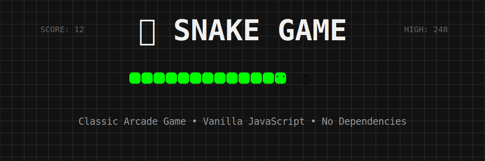
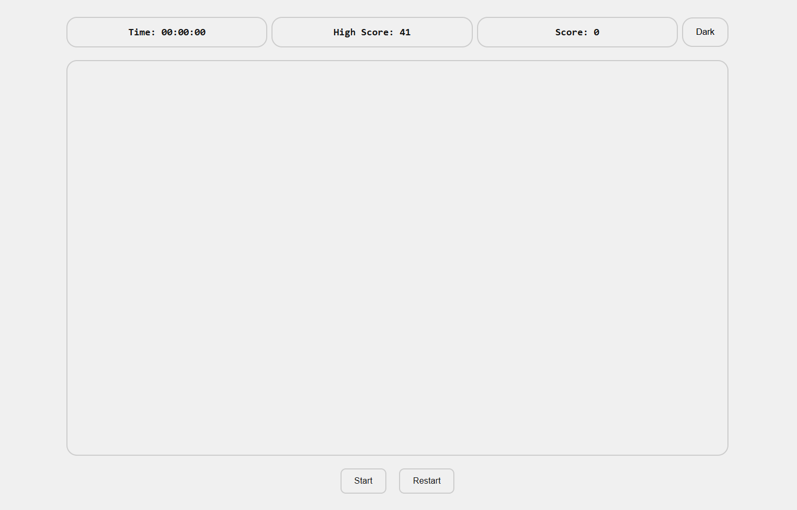
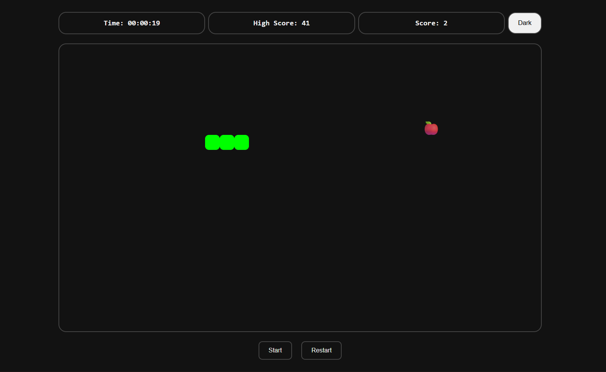

# 🐍 Snake Game

<div align="center">



**A classic Snake game built with vanilla JavaScript**

[Play Now](#getting-started) • [Features](#features) • [Controls](#controls)

</div>

---

## 📖 About

A fast, responsive Snake game implementation using pure vanilla JavaScript, HTML5, and CSS3. No frameworks, no dependencies - just classic arcade gaming fun in your browser! Challenge yourself to beat your high score while the snake grows longer with each apple eaten.

## ✨ Features

- 🎮 **Classic Gameplay** - Smooth snake movement with collision detection
- 🏆 **High Score Tracking** - Persistent high scores saved in local storage
- ⏱️ **Timer** - Track how long you've been playing
- 🌓 **Theme Switcher** - Toggle between light and dark modes
- 📱 **Responsive Design** - Works on desktop and mobile devices
- ⚡ **Vanilla JavaScript** - No frameworks or external dependencies
- 💾 **Local Storage** - Saves high score and theme preferences
- 🎯 **Wrapping Borders** - Snake wraps around screen edges

## 🎮 Controls

| Key                    | Action                  |
| ---------------------- | ----------------------- |
| **Arrow Up** ⬆️        | Move Up                 |
| **Arrow Down** ⬇️      | Move Down               |
| **Arrow Left** ⬅️      | Move Left               |
| **Arrow Right** ➡️     | Move Right              |
| **Start/Pause Button** | Start or pause the game |
| **Restart Button**     | Restart the game        |
| **Theme Button**       | Toggle light/dark mode  |

## 🚀 Getting Started

### Prerequisites

- A modern web browser (Chrome, Firefox, Safari, Edge)
- No additional software required!

### Installation

1. **Clone the repository**

   ```bash
   git clone https://github.com/yourusername/snake-game.git
   ```

2. **Navigate to the project directory**

   ```bash
   cd snake-game
   ```

3. **Open in browser**

   - Simply open `index.html` in your web browser
   - Or use a local server:

     ```bash
     # Using Python 3
     python -m http.server 8000

     # Using Node.js
     npx serve
     ```

   - Then visit `http://localhost:8000`

## 📁 Project Structure

```
snake-game/
│
├── index.html          # Main HTML file
├── script.js           # Game logic and functionality
├── styles.css          # Styling and themes
├── default-og.png      # Open Graph image
└── README.md           # Project documentation
```

## 🎯 How to Play

1. **Start the Game** - Click the "Start" button or press it to begin
2. **Control the Snake** - Use arrow keys to change direction
3. **Eat Apples** 🍎 - Guide the snake to the red apple to grow longer
4. **Avoid Collision** - Don't run into yourself!
5. **Beat Your High Score** - Try to grow the longest snake possible

### Game Rules

- The snake moves continuously in the current direction
- You cannot reverse direction (e.g., if moving right, can't go directly left)
- Each apple eaten increases your score by 1
- The snake grows longer with each apple consumed
- Game ends when the snake collides with itself
- The snake wraps around screen edges (goes through walls)

## 🛠️ Technologies Used

- **HTML5** - Structure and semantics
- **CSS3** - Styling, animations, and responsive design
  - CSS Grid for game board layout
  - CSS Custom Properties for theming
  - CSS Animations for visual effects
- **Vanilla JavaScript** - Game logic and interactivity
  - DOM manipulation
  - Event handling
  - Local Storage API
  - Game loop with setInterval

## 🎨 Customization

### Changing Game Speed

Edit the `SPEED` constant in `script.js`:

```javascript
const SPEED = 150; // milliseconds (lower = faster)
```

### Changing Block Size

Modify the `--block-size` CSS variable in `styles.css`:

```css
:root {
  --block-size: 30px; /* Change this value */
}
```

### Adding New Themes

Extend the CSS variables in the `.dark` class or create new theme classes in `styles.css`.

## 🌟 Features in Detail

### High Score System

- Automatically saves your highest score to browser local storage
- Persists across browser sessions
- Updates in real-time when you beat your record

### Theme Support

- Light mode (default) with bright, clean aesthetics
- Dark mode for comfortable night-time gaming
- Theme preference saved in local storage
- Smooth transitions between themes

### Responsive Design

- Adapts to different screen sizes
- Touch-friendly on mobile devices
- Flexible grid layout adjusts to available space

## 📊 Browser Compatibility

- ✅ Chrome (latest)
- ✅ Firefox (latest)
- ✅ Safari (latest)
- ✅ Edge (latest)
- ✅ Opera (latest)

## 🤝 Contributing

Contributions are welcome! Here's how you can help:

1. Fork the repository
2. Create a feature branch (`git checkout -b feature/AmazingFeature`)
3. Commit your changes (`git commit -m 'Add some AmazingFeature'`)
4. Push to the branch (`git push origin feature/AmazingFeature`)
5. Open a Pull Request

## 📝 License

This project is open source and available under the [MIT License](LICENSE).

## 👨‍💻 Author

**Your Name**

- GitHub: [@yourusername](https://github.com/yourusername)

## 🙏 Acknowledgments

- Inspired by the classic Nokia Snake game
- Built as a learning project for vanilla JavaScript game development
- Thanks to the open-source community for inspiration

## 📸 Screenshots

### Light Mode



### Dark Mode



---

<div align="center">

**Enjoy the game! 🎮🐍**

If you like this project, please give it a ⭐

</div>
